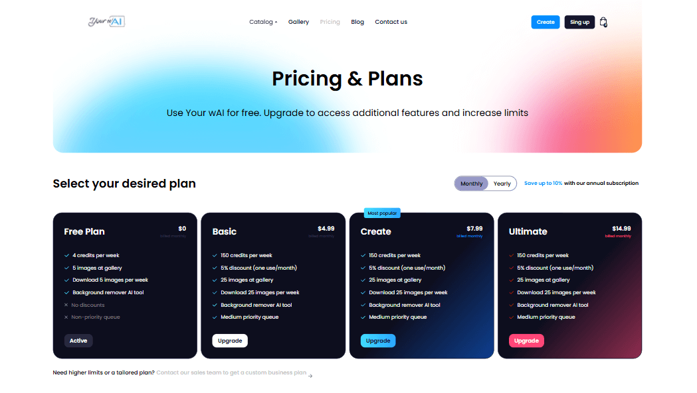
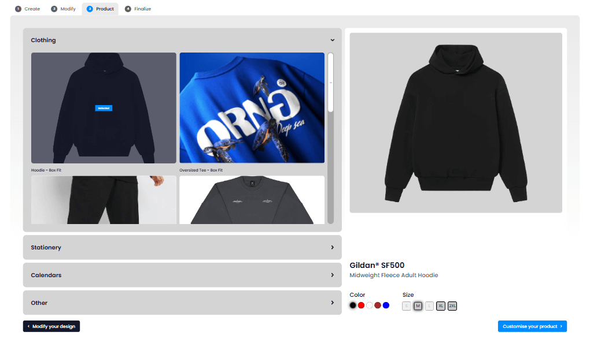
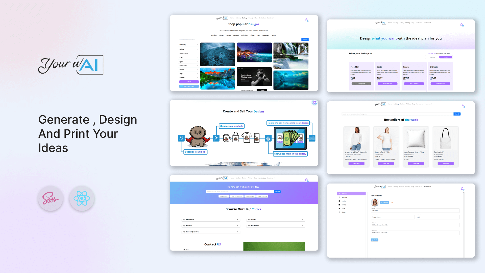

 

  

 

 

<table align="center" width="100%">
<tr>
<td width="100%">

### A short manifesto

*I don't just write components — I design the systems they live in.*
*Since 2022 I've been building complete products end-to-end: interfaces that feel*
*intentional, APIs that hold up under real usage, and mobile apps that behave*
*like they were made by people who actually use them.*
*Currently building at* **[Hiprax](https://www.hiprax.com)** *— frontend-heavy, backend-capable, always shipping.*

</td>
</tr>
</table>

 

 

## ◇ What I actually build

<table width="100%">
<tr>
<td width="50%" valign="top">

**Full-stack web applications**
End-to-end products — architecture, API design, database modeling, and the interface people actually touch.

 

**Mobile applications**
React Native apps that share logic with the web layer without feeling like a compromise.

</td>
<td width="50%" valign="top">

**Backend architecture & APIs**
Clean, scalable services — auth, validation, real-time layers, and systems built to be maintained, not just shipped.

 

**Automation & web crawling**
Puppeteer-driven scraping, testing, and workflow automation for data that needs to move on its own.

</td>
</tr>
</table>

 

 

## ◇ The stack

**Core**
 

  

**Backend**
 

  

**Interfaces & state**
 

  

**Design systems & motion**
 

  

**Tooling & craft**
 

  

Also fluent in BEM · RTL support · SEO fundamentals · responsive systems · Canva

 

 

## ◇ Activity

 

— replace `saeedmirzade` above with your exact GitHub username so the widgets resolve to your account —

  

 

## ◇ Selected work

A handful of the products I've shipped — case studies, not a repo list.

 

### 01 · Yape WorldCup
`Web Application`
World Cup–themed web platform built for high engagement during a live global event.

 

### 02 · Samu Wellness
`Web Application` · `Health & Wellness`
A wellness-focused platform combining content, interaction, and a calm, considered interface.

 

### 03 · Universai
`Web Application` · `AI-oriented product`
A product-style platform built around an AI-driven experience layer.

 

### 04 · ITSYourwai
`Web Platform`
A multi-view web platform with a broad feature surface — the largest UI footprint in this collection.

 

### 05 · Logisticly Unique
`Web Application` · `Logistics`
A logistics-oriented platform for coordinating operations through a structured, dashboard-driven interface.

 

### 06 · Goverme
`Web Platform`
A structured, form-and-data-heavy platform built for organizational workflows.

 

### 07 · Hiprax Admin Template
`Admin Dashboard` · `Team project — Hiprax`
A reusable admin dashboard template — the kind of system that other products get built on top of.

 

### 08 · Checked And Verified
`Web Application` · `Verification`
A verification-focused platform with a clean, trust-driven interface.

 

### 09 · Beauty Online Shop
`E-Commerce`
An online storefront built for browsing and conversion in the beauty retail space.

 

### 10 · Ticketing Management System
`Web Application` · `Internal Tooling`
A system for creating, tracking, and resolving tickets across a workflow.

 

### 11 · Personal Portfolio
`Portfolio Site`
A personal showcase site — the predecessor to the identity you're looking at right now.

 

 

## ◇ Let's build something

  

Full-stack developer · Product builder · Frontend-focused, backend-capable

