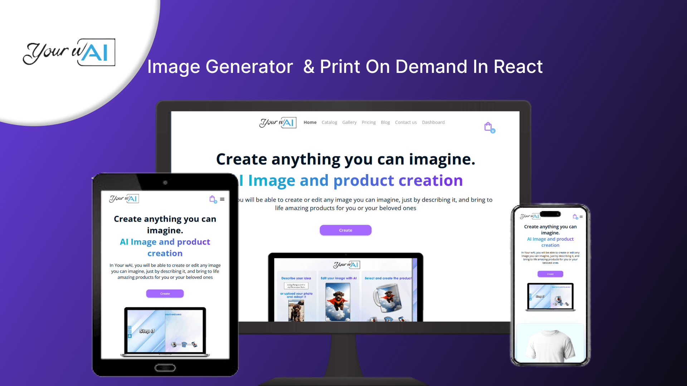

 

  

 

 

## 🧑‍💻 About Me

whoami: Saeed Mirzade
role: Full Stack Developer
focus: [Admin Dashboards, E-commerce, AI Tools, Portfolios]
mindset: "Ship fast, polish forever ✨"
currently_exploring: Next.js 15 • AI-powered UIs • Motion Design
fun_fact: "I turn 'just an idea' into a working prototype overnight 🌙"
 

## ⚡ Tech Arsenal

  

 

## 🚀 Featured Projects

 

### 🛠️ Hiprax Admin Template
*A powerful, elegant admin dashboard built for speed and clarity*

  
  
  

### 🛍️ Beauty Online Shop
*A curated e-commerce experience blending style with usability*

  

### 🤖 ITSYourwai
*AI-powered tooling designed for effortless interaction*

  
  
  

### 🙋‍♂️ Personal Portfolio
*My digital home — a showcase of craft and code*

  

### 🎟️ Ticketing Management System
*Streamlined ticket workflows for teams that move fast*

  

## 📊 Live Stats

  
  

  

  

  

## 🐍 Contribution Snake

  

  ✨ Powered by a GitHub Action — auto-generates a snake eating your contribution graph. Add the <a href="https://github.com/Platane/snk">Platane/snk</a> workflow to your profile repo to activate this.

## 🌐 Let's Connect

  

  ⭐ If any of this sparked an idea — drop a star, say hi, or fork a project. Thanks for stopping by!

