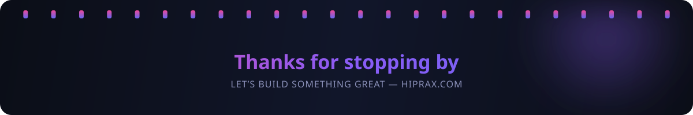

## About Me

Experienced Full-Stack Developer since 2022, deeply rooted in the MERN stack and React Native. I specialize in React.js, React Native, Node.js, TypeScript, SCSS, and MongoDB — building robust, scalable, and secure web & mobile applications with a strong focus on performance, maintainability, and clean architecture.

I own the full pipeline end-to-end — from intuitive, high-performance UIs to optimized, secure server-side systems — and thrive in fast-paced environments solving complex problems with efficient code and smart design patterns.

Currently a team member at [Hiprax](https://www.hiprax.com), where I help build and ship production-grade products.

### Open to Collaborate On

▹ Large-scale, high-impact full-stack web & mobile applications
▹ Backend architecture, API design, and performance tuning
▹ Frontend & mobile systems with advanced interactivity and UX
▹ Open-source initiatives and developer tooling

## Tech Stack

## See What I Actually Build

Full case studies, live work experience, and project deep-dives live on my portfolio — not here.

  

## Project Screenshots

_A visual walkthrough of shipped products — click a project to expand._

  
  
  

  
  
  
  

  
  

  
  

  
  
  
  
  

  
  
  
  

  
  
  

  
  
  

  

  
  
  

  

  

### Want the full story — role history, stack decisions, and case studies?

