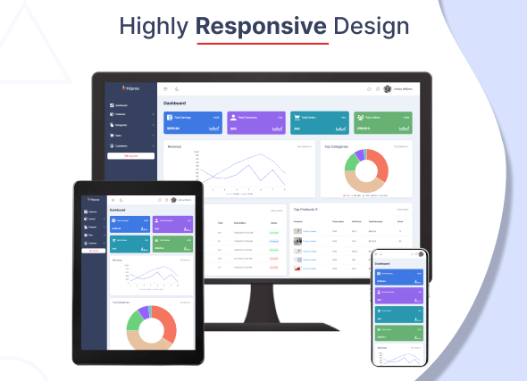
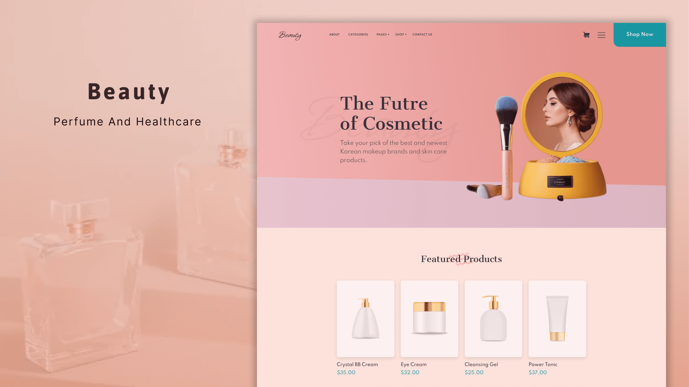
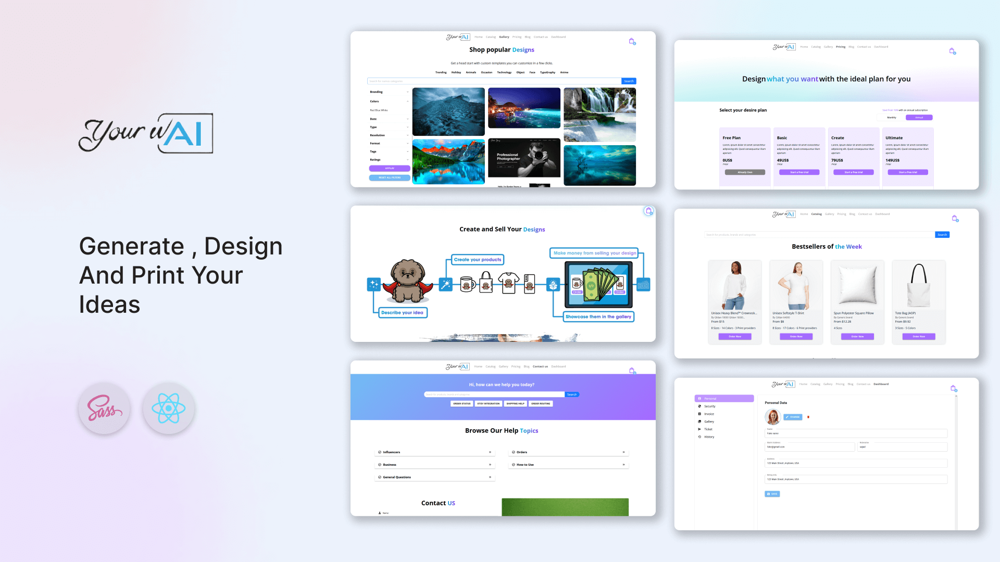

# 💫 About Me:

I’m a Senior Full-Stack Developer with deep expertise in the MERN stack and React Native, specializing in React.js, React Native, Node.js, TypeScript, SCSS, and MongoDB. I design and build robust, scalable, and secure web and mobile applications with a strong focus on performance, maintainability, and clean architecture

 
With a solid command of both frontend and backend development, I deliver end-to-end solutions — from intuitive, high-performance user interfaces to optimized, secure server-side systems. I thrive in fast-paced environments and enjoy solving complex problems using efficient code and smart design patterns.

 
 
🤝 Open to Collaborate On:
 

 

Large-scale, high-impact full-stack web and mobile applications

Backend architecture, API design, and performance tuning

Frontend and mobile systems with advanced interactivity and UX focus

Open-source initiatives and developer tooling
## 🌐 Socials:

# 💻 Tech Stack

### Frontend

### Backend

### Styling & UI

  

### Animations & Graphics

### Tools & Workflow

### Security & Validation

### Design & CMS

### Other Skills

# 🖼️ Project Screenshot

## ✅ Checked And Verified

  
  

## 🌐 Universai

  
  

## 🤖 ITSYourwai

  
  
  
  
  

## 🚚 Logisticly Unique

  
  
  
  

## 🏛️ Goverme

  
  
  

## 🛠️ Hiprax Admin Template

  
  
  

## 🛍️ Beautiy Online Shop

  

## 🤖 ITSYourwai (More)

  
  
  

## 🙋‍♂️ Personal Portfolio

  

## 🎟️ Ticketing Management System

  

